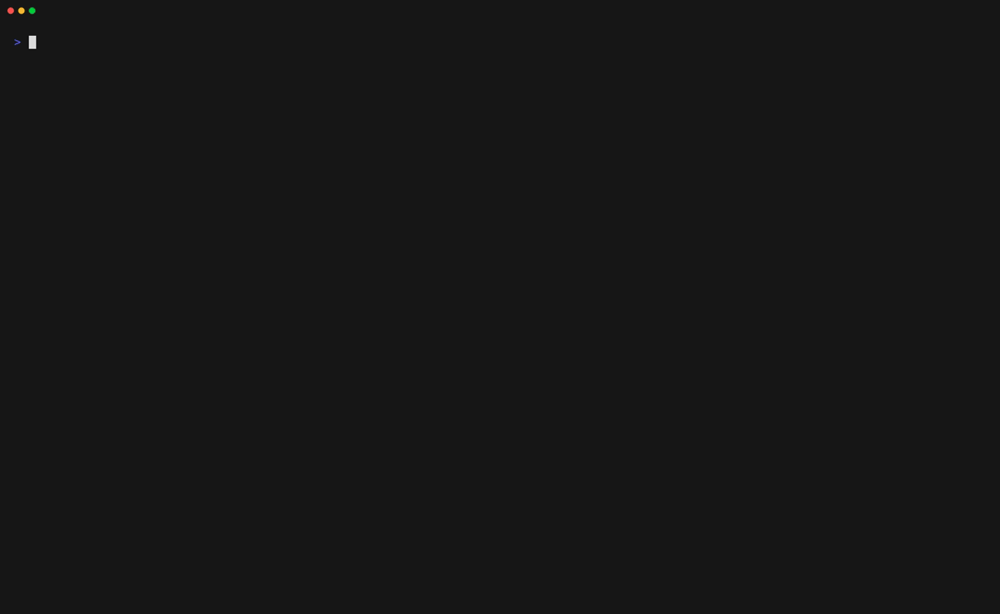
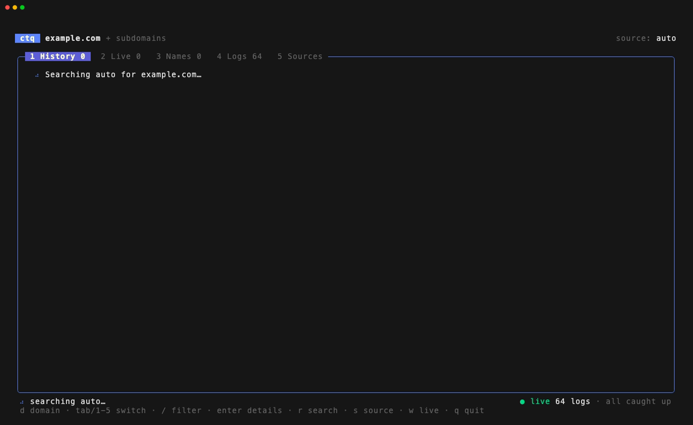
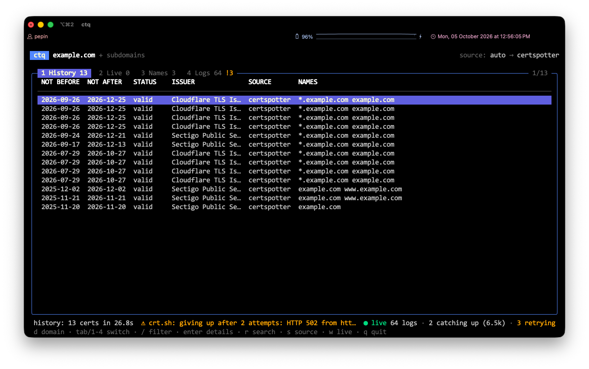
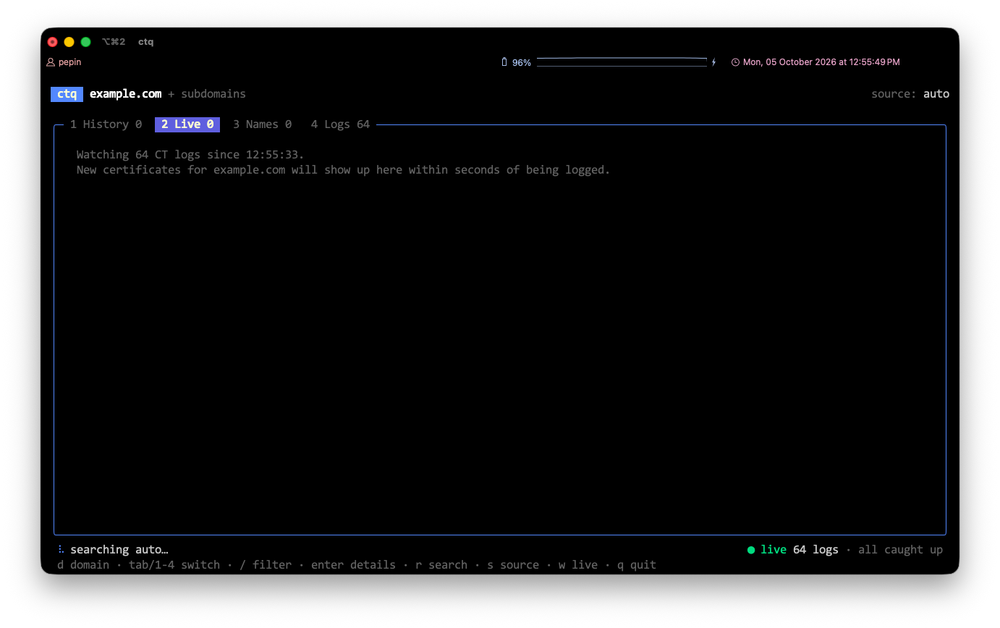
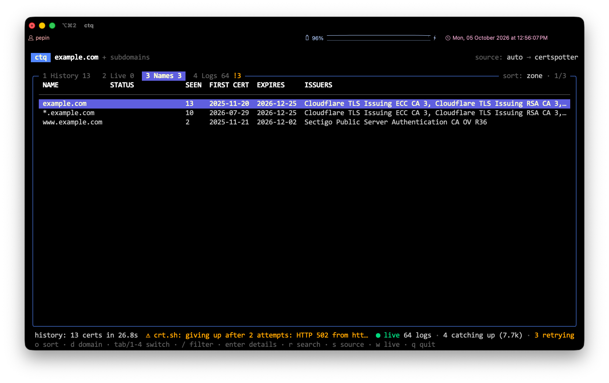
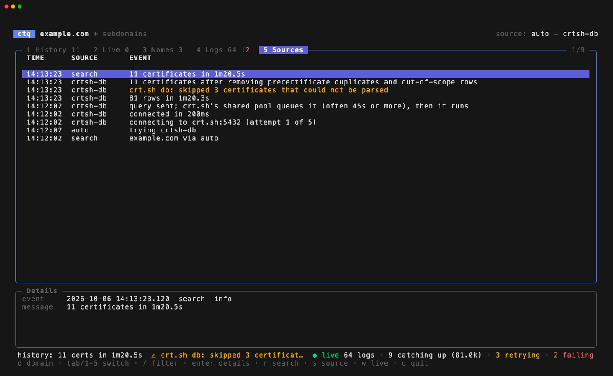

# ctq

An interactive [Certificate Transparency](https://certificate.transparency.dev/) explorer for the terminal.



Point `ctq` at a domain and it shows every TLS certificate issued for it and its subdomains. Past certificates come from CT aggregators; new ones stream in straight from the CT logs within seconds of being logged. Typical uses are subdomain discovery, spotting certificates you didn't request, and keeping an inventory of what's exposed.

The same engine is available as plain CLI commands for scripts and pipes.

## Install

Download a binary for Linux, macOS or Windows (amd64 and arm64) from the [releases page](https://github.com/jfagoagas/ctq/releases), or install with Go 1.21 or later:

```sh
go install github.com/jfagoagas/ctq@latest
```

ctq needs Go 1.26 to build. Older Go versions (1.21+) download that toolchain automatically and print a "switching" message.

### Verify a release

Every archive in a release has a signed [SLSA build provenance](https://slsa.dev/) attestation and an SPDX SBOM attestation, both created by the release workflow. To check that a download was built from this repository by that workflow:

```sh
gh attestation verify ctq_<version>_linux_amd64.tar.gz --repo jfagoagas/ctq
```

Add `--predicate-type https://spdx.dev/Document/v2.3` to verify the SBOM attestation instead. The SBOM itself is attached to the release next to each archive (`*.sbom.json`), so you can scan a release for known vulnerabilities without running it:

```sh
grype sbom:ctq_<version>_linux_amd64.tar.gz.sbom.json
```

Releases are gated on the same scan: nothing is published while a fixable high or critical vulnerability is known in the Go toolchain or a dependency. The latest release's SBOMs are rescanned every week.

Or from source:

```sh
git clone https://github.com/jfagoagas/ctq
cd ctq
go build .
```

## The TUI

```sh
ctq tui example.com
ctq tui            # opens on the domain prompt
```

The search and the live feed start together. Press `d` at any time to switch to another domain.

<table>
  <tr>
    <td width="50%"></td>
    <td width="50%"></td>
  </tr>
  <tr>
    <td>On launch, the search runs while the live feed connects to every CT log.</td>
    <td>History lists one row per certificate. The header shows which source answered: here <code>auto</code> got its results from crt.sh's database.</td>
  </tr>
  <tr>
    <td width="50%"></td>
    <td width="50%"></td>
  </tr>
  <tr>
    <td>Live shows certificates as they're logged. Until one arrives, it says how many logs it's watching.</td>
    <td>Names merges History and Live into one row per name, sorted by zone so a subdomain's children stay together.</td>
  </tr>
  <tr>
    <td colspan="2"></td>
  </tr>
  <tr>
    <td colspan="2">Sources shows each step of the search: connections, retries, the wait in crt.sh's queue and the final count. Press enter for the full message, such as an error the status line cuts off.</td>
  </tr>
</table>

| Tab | Content |
|-----|---------|
| History | certificates already logged, from crt.sh (its database or its API) or Cert Spotter |
| Live | certificates arriving from the CT logs, newest first |
| Names | every unique name from both, with status, certificate count, first certificate, latest expiry and issuers |
| Logs | health of each CT log the live feed reads: position, lag, status and last error |
| Sources | what each search source did: connections, requests, retries, pages and fallbacks, newest first. Press enter on a row for the full, untruncated message |

Names sorts by zone by default (`api.dev.example.com` next to `web.dev.example.com`). Press `o` to sort by newest first certificate, soonest expiry, or most certificates. The status column tags each name:

| Tag | Meaning |
|-----|---------|
| `new` | first certificate in the last 7 days |
| `live` | seen in the live feed this session |
| `expiring` | latest certificate expires within 14 days |
| `expired` | every certificate for the name has expired |

A log that fails a poll shows as `retrying` and is retried on the next poll. After 3 failures in a row it shows as `failing`. Tiled logs sometimes publish a checkpoint before its tiles are readable, so an occasional `retrying` is normal.

| Key | Action |
|-----|--------|
| `d` | search a different domain |
| `tab`, `shift+tab`, `1`-`5` | switch tab |
| `↑` `↓` | move |
| `/` | filter the current tab: names, issuers, logs or search events (`esc` clears) |
| `enter` | show details for the selected row |
| `o` | change the sort order (Names tab) |
| `r` | search again |
| `s` | cycle the search source |
| `w` | turn the live feed on or off |
| `q` | quit |

`ctq tui` accepts the `search` flags `-source`, `-exact`, `-expired` and `-timeout`, the `watch` flags `-interval`, `-workers` and `-state`, and `-no-live` to start with the live feed off.

## CLI

The TUI is built on two commands you can also run on their own:

```
ctq search [flags] <domain>   certificates already logged (crt.sh, Cert Spotter)
ctq watch  [flags] <domain>   new certificates, tailed directly from all CT logs
```

The domain covers its subdomains by default. Pass `-exact` to match only the domain itself. Wildcard input such as `*.example.com` is treated as `example.com`.

### search

```sh
ctq search example.com                  # unique names, one per line
ctq search -o table example.com         # one row per certificate
ctq search -o json example.com | jq .   # full records
ctq search -source crtsh -expired example.com
```

| Flag | Default | Description |
|------|---------|-------------|
| `-source` | `auto` | `auto`, `crtsh-db`, `crtsh` or `certspotter` |
| `-o` | `names` | `names`, `table` or `json` |
| `-exact` | `false` | only the domain itself, no subdomains |
| `-expired` | `false` | include expired certificates (crt.sh sources only) |
| `-issuer` | | only certificates whose issuer contains this text |
| `-timeout` | `60s` | per-request timeout (`crtsh-db` always gets at least 3m) |
| `-v` | `false` | print each source's connections, requests, retries and fallbacks to stderr |

`auto` tries crt.sh's database first, then the crt.sh API, then Cert Spotter. crt.sh fails often under load, and some networks block the database port (5432).

### watch

```sh
ctq watch example.com
ctq watch -json example.com >> example.jsonl
ctq watch -state ~/.ctq-state.json -v example.com
```

Each match prints one line with the time, entry type (`cert` or `precert`), issuer, matching names and log. A certificate seen in several logs is reported once.

| Flag | Default | Description |
|------|---------|-------------|
| `-exact` | `false` | only the domain itself, no subdomains |
| `-interval` | `15s` | poll interval per log |
| `-workers` | `4` | concurrent fetches per log |
| `-state` | | file that stores log positions, so a restart resumes where it stopped |
| `-log` | | only logs whose name contains this text |
| `-json` | `false` | emit JSON lines |
| `-v` | `false` | print progress and lag per log to stderr |

Without `-state`, `watch` starts at the current end of each log and only reports certificates logged after it starts. If `-v` shows lag growing, raise `-workers`.

## Using ctq with AI agents

Coding agents such as Claude Code can't drive the TUI, which needs an interactive terminal. The CLI works well for them:

- `ctq search -o json example.com` prints a JSON array on stdout, one object per certificate: `id`, `source`, `issuer`, `dns_names`, `not_before`, `not_after` and `expired`. Warnings and `-v` output go to stderr, so stdout always parses.
- `ctq search example.com` prints one name per line, the smallest output for a context window.
- The exit status is 0 on success, including when nothing is found (an empty array), 1 on errors and 2 for an unknown command.
- The domain argument is validated before any query, so input an agent builds from a conversation can't turn into a crt.sh wildcard.

Three things trip agents up:

- A search through crt.sh's database takes about a minute, sometimes more. Give the command at least 4 minutes; Claude Code's Bash tool stops a command after 2 minutes unless told otherwise. `-source certspotter` answers in seconds but only returns unexpired certificates, under a rate limit.
- `watch` never exits on its own. Run it with a bound, for example `timeout 10m ctq watch -json example.com` (on macOS, `gtimeout` from coreutils). Each line is one JSON object.
- When a search fails, `-v` shows each source's attempts on stderr instead of only the last error.

To teach an agent all of this, add a section like this to the project's `AGENTS.md` or `CLAUDE.md`:

```markdown
## Certificate Transparency lookups

Use `ctq` to find certificates and subdomains for a domain.

- `ctq search -o json <domain>`: JSON array on stdout, warnings on stderr. Exit 0 even when empty.
- Allow at least 4 minutes per search: crt.sh's database queues each query for about a minute.
- Fast, unexpired certificates only: `-source certspotter`. Include expired certificates: `-expired`.
- Never run `ctq tui`, it's interactive. Always run `ctq watch` under `timeout`.
- If a search fails, rerun it with `-v` and read stderr.
```

In Claude Code, `"allow": ["Bash(ctq search:*)"]` in `.claude/settings.json` lets the agent run searches without asking each time. `search` only reads public CT data.

## How it works

Certificate Transparency logs are append-only Merkle trees. Chrome and Safari reject publicly trusted certificates that weren't logged, so CAs submit every certificate they issue. The logs can only be read by position: there is no way to ask a log for one domain's certificates. Searching by domain needs a service that has read every log and indexed the result.

So `ctq` uses two kinds of sources:

| Command | Source | What it covers |
|---------|--------|----------------|
| `search` (`crtsh-db`) | crt.sh's public Postgres (`guest@crt.sh:5432/certwatch`) | full history including expired certificates, also for domains with thousands of certificates; slow (the shared pool queues every query, about a minute) and needs outbound port 5432 |
| `search` (`crtsh`) | [crt.sh](https://crt.sh) | full history including expired certificates; one request, but its database times out on large domains |
| `search` (`certspotter`) | [Cert Spotter](https://sslmate.com/certspotter/) | unexpired certificates only; paginated and more reliable, but rate limited (the free plan allows 10 full-domain queries per hour) |
| `watch` | the CT logs in [Chrome's log list](https://www.gstatic.com/ct/log_list/v3/log_list.json) | new entries from the moment it starts |

`crtsh-db` verifies the server certificate chain and hostname against the system roots. crt.sh's database certificate expired on 2026-06-21, so there is one exception: an expired certificate is accepted only if its key is the one pinned in the code (SHA-256 `f5178a69…21ebda`), which is also the key of crt.sh's valid HTTPS certificate. Any other expired certificate is rejected. Once crt.sh renews the database certificate, standard verification passes and the pin is no longer used.

`watch` reads both log protocols in use today: [RFC 6962](https://www.rfc-editor.org/rfc/rfc6962) and the tiled [static-ct-api](https://c2sp.org/static-ct-api), which Let's Encrypt and others have moved to. It skips logs whose expiry window has already closed, since they receive no new certificates.

## Configuration

| Variable | Description |
|----------|-------------|
| `CERTSPOTTER_API_KEY` | Cert Spotter API key. Without one, the API allows about 10 requests per hour, and each page of results is one request. |

## Limitations

- `watch` doesn't verify log signatures or Merkle inclusion proofs. It trusts the log operators and TLS, which is fine for finding certificates but not for auditing logs.
- crt.sh is a free, shared service and is often overloaded. Its database queues every query for about a minute, and it sometimes refuses connections; `auto` retries, then falls back to the crt.sh API and Cert Spotter. The Sources tab and `search -v` show which step failed.
- `crtsh-db` needs outbound access to port 5432. On networks that block it, `auto` falls back after one retry.
- `crtsh-db` skips certificates that Go's X.509 parser rejects (some malformed certificates from public CAs), and says how many in a warning.
- Cert Spotter doesn't return expired certificates, so `-expired` only works with the crt.sh sources.
- Duplicate detection in `watch` keeps a bounded set of recent certificates, so a rare duplicate can get through on a long run.

## Related projects

`ctq` is for exploring a domain interactively. For other jobs, these tools are a better fit:

- [certspotter](https://github.com/SSLMate/certspotter): unattended monitoring of a watchlist, with alerts through scripts or email. Made by SSLMate, who also run the Cert Spotter API that `ctq search` uses.
- [gungnir](https://github.com/g0ldencybersec/gungnir): streams new domains from all CT logs to stdout, JSONL or NATS, for recon pipelines.
- [subfinder](https://github.com/projectdiscovery/subfinder): passive subdomain enumeration from many sources, crt.sh among them.
- [ctfr](https://github.com/UnaPibaGeek/ctfr) and [crt](https://github.com/cemulus/crt): quick crt.sh subdomain lookups from the command line.

## Development

```sh
go test -race ./...
CTQ_LIVE=1 go test -run TestLive -v ./internal/ct/   # checks parsing against real CT logs
```

Unit tests use local HTTP servers and fakes; nothing touches the network unless `CTQ_LIVE` is set.

### Git hooks

Checks run locally with [pre-commit](https://pre-commit.com/) (config in `.pre-commit-config.yaml`). Install the hooks once per clone:

```sh
pre-commit install --hook-type pre-commit --hook-type pre-push
```

On commit: [golangci-lint](https://golangci-lint.run/) v2 (config in `.golangci.yml`, includes gofmt and goimports), [trufflehog](https://github.com/trufflesecurity/trufflehog) on the staged changes, actionlint and zizmor on the workflows, `go mod tidy -diff`, and basic file hygiene. On push: `go test -race ./...`. The first run builds golangci-lint, trufflehog and actionlint from source with your Go, so it takes a few minutes; later runs are fast.

```sh
pre-commit run --all-files                         # every commit-stage hook on every tracked file
pre-commit run golangci-lint-full --all-files      # one hook
pre-commit run --all-files --hook-stage pre-push   # the push-stage hooks
```

CI runs the same checks, so `git commit --no-verify` only moves a failure to the pull request.

The README screenshots and the demo GIF are made with [vhs](https://github.com/charmbracelet/vhs) from the tapes in `docs/screenshots/`. They run a real search, so they need network access and take a few minutes:

```sh
vhs docs/screenshots/screenshots.tape
vhs docs/screenshots/demo.tape
```

CI also validates the release config, audits the workflows with [zizmor](https://docs.zizmor.sh/), and scans each platform's binary with [syft](https://github.com/anchore/syft) and [grype](https://github.com/anchore/grype). To run the same checks locally:

```sh
goreleaser check
zizmor --persona auditor .github/
grype dir:.   # dependencies only; CI scans the built binary, which adds the Go stdlib
```

To accept a grype finding that doesn't apply to ctq, add it to `.grype.yaml` with a reason.

Releases are cut by pushing a `v*` tag; `.github/workflows/release.yml` does the rest.

## License

[MIT](LICENSE)
